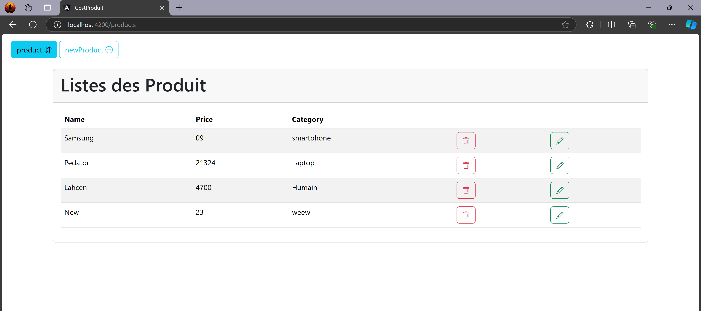
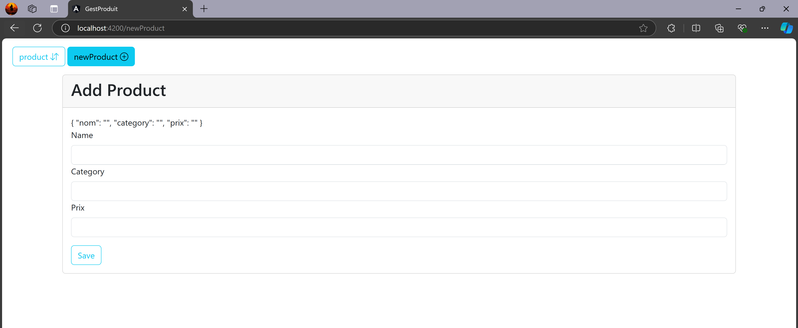

# Angular Product Management CRUD Application 
This project is a CRUD (Create, Read, Update, Delete) application for managing products, built using Angular.
It allows users to perform basic operations such as creating new products, viewing a list of products, updating product details, and deleting products.
The project uses Bootstrap for styling and JSON Server for simulating a backend server.

## Prerequisites :
Before starting the project, make sure to install the following dependencies:
1. JSON Server: To simulate the backend API for product management.
- `npm install -g json-server`
2. Concurrently: To run both the Angular app and JSON server simultaneously.
- `npm install concurrently`

## Running the Project :
1. Clone the repository to your local machine.
1. Navigate to the project directory and install the required dependencies using the following command: `npm install`
1. Start the Angular application and JSON Server simultaneously by running: `npm start`

This will automatically open your browser to `http://localhost:4200`, where you can interact with the application.
The JSON Server will run on `http://localhost:5555`, serving the product data from `db.json`.

## Project Features :

- Product Listing: View all available products in a table format.
- Add New Product: Create new products by entering details such as name, price, and description.
- Edit Product: Update the information of existing products.
- Delete Product: Remove products from the database.

## Screenshots :

